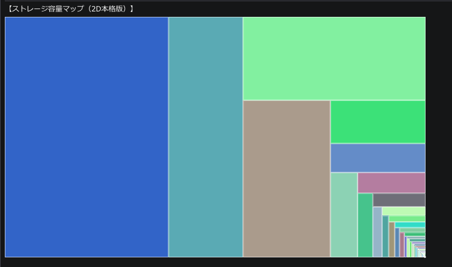

# Storage Capacity Visualization (超高速ストレージ可視化ツール)

C++17とDear ImGuiを用いてゼロから構築した、Windows環境向けの超高速ストレージ可視化ツールです。
指定したディレクトリ以下のファイル容量をマルチスレッドで並列スキャンし、結果を2Dツリーマップ（Slice and Dice アルゴリズム）としてリアルタイムにグラフィック描画します。

## 主な機能と特徴
* **爆速スキャンエンジン:** `std::filesystem` とマルチスレッド (`std::thread`, `std::mutex`, `std::atomic`) を組み合わせ、I/O待ちを極限まで減らした並列処理を実装。
* **フリーズしない非同期UI:** スキャン処理をバックグラウンドスレッドに分離し、UI描画用のメインスレッドと共有変数で通信することで、重いスキャン中も60FPSでヌルヌル動くUIを実現。
* **2Dツリーマップ描画:** フォルダごとの容量比率を計算し、動的にキャンバスの縦横比を判定して敷き詰める分割アルゴリズムを実装。ツールチップでの詳細表示にも対応。

##  パフォーマンス（ベンチマーク）
* **スキャン対象:** `C:\Windows` (システムフォルダ)
* **ファイル数:** 約 225,000 個
* **合計サイズ:** 約 54.8 GB
* **処理時間:** **約 15秒** (※16スレッド稼働時)

## 使用技術
* **言語:** C++17
* **GUIライブラリ:** Dear ImGui (DirectX11バックエンド)
* **コンパイラ:** GCC (MinGW-w64)

## Author
* ImTsubacha